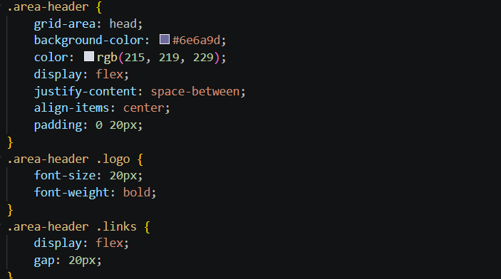
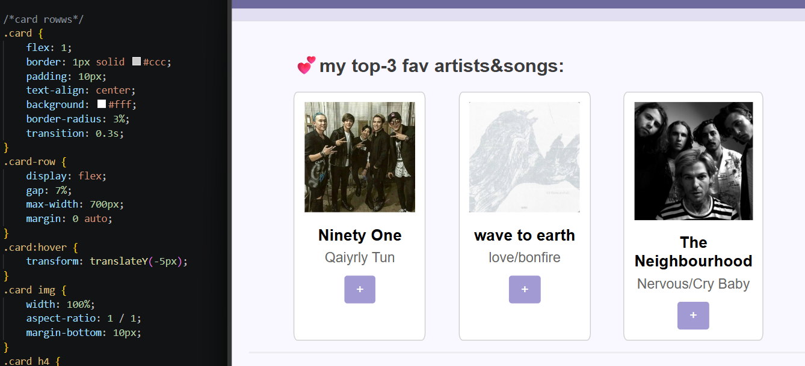
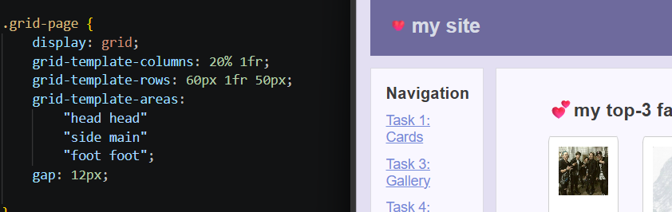
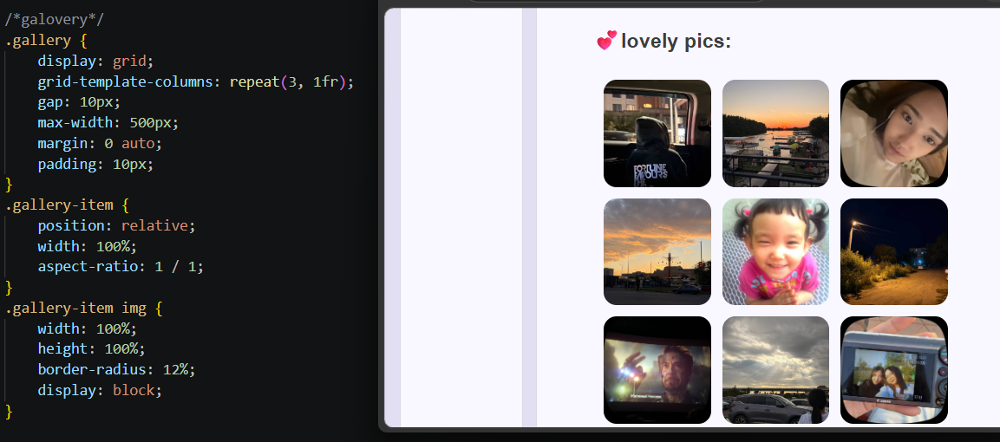
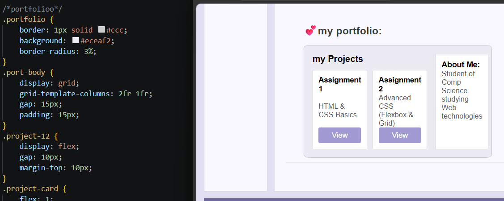

Assignment #2 – Advanced CSS (Flexbox & Grid)

Name: Amirgaliyeva Saida  
Group: IT-2513

Part 1. Flexbox
Task 0. Navigation Bar
I created a header with a logo on the left and navigation links on the right. I used Flexbox to place the elements horizontally, add spacing between the links, and vertically center the content.

Task 1. Card Row
I created three cards with images, titles, text, and buttons. The cards are placed in one row using Flexbox. I used `flex: 1` to give the cards equal space and `gap` to add spacing between them. I also added a hover effect that moves the card slightly upward.

Part 2. Grid System
Task 2. Page Layout with Grid Areas
I created the main page layout using CSS Grid. The page contains a header, sidebar, main content, and footer. I used "grid-template-areas" to define the position of each section.

The header and footer span across the page, while the sidebar is on the left and the main content is on the right.

Task 3. Image Gallery
I created a gallery with nine images. CSS Grid is used to organize the images into three equal-width columns. I added gaps between the images and a caption overlay that appears when the user hovers over an image.

Part 3. Combining Flexbox & Grid
Task 4. Portfolio Page
I created a small portfolio section using both CSS Grid and Flexbox. The portfolio has a projects area on the left and an information sidebar on the right.
CSS Grid is used for the main portfolio layout:

Flexbox is used inside the project area and project cards:

Summary:
In this assignment, I practiced using Flexbox and CSS Grid to create different website layouts. I used Flexbox for the navigation bar, cards, and project cards. I used CSS Grid for the main page layout, image gallery, and portfolio section. I also added gaps, alignment, and hover effects to make the page more organized and interactive.